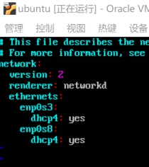
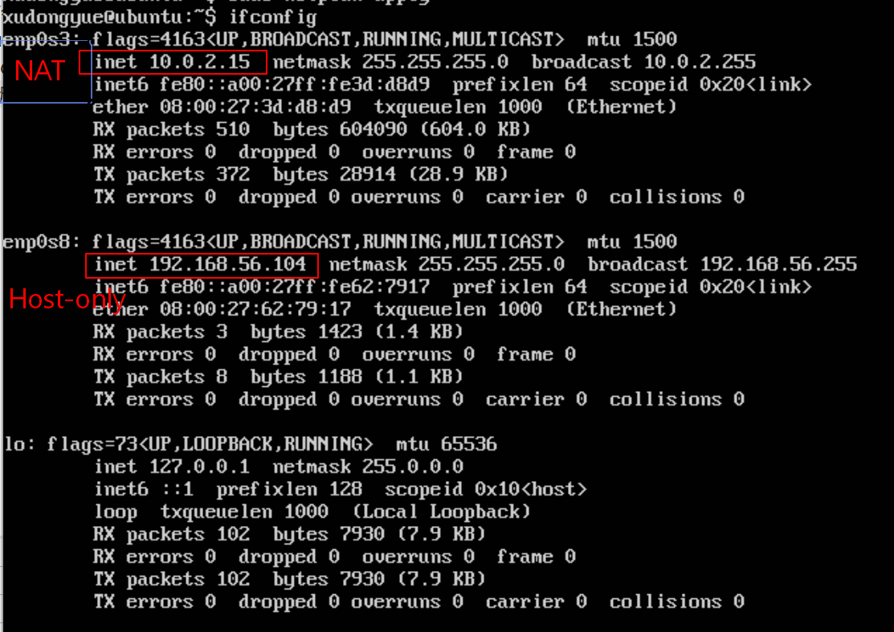
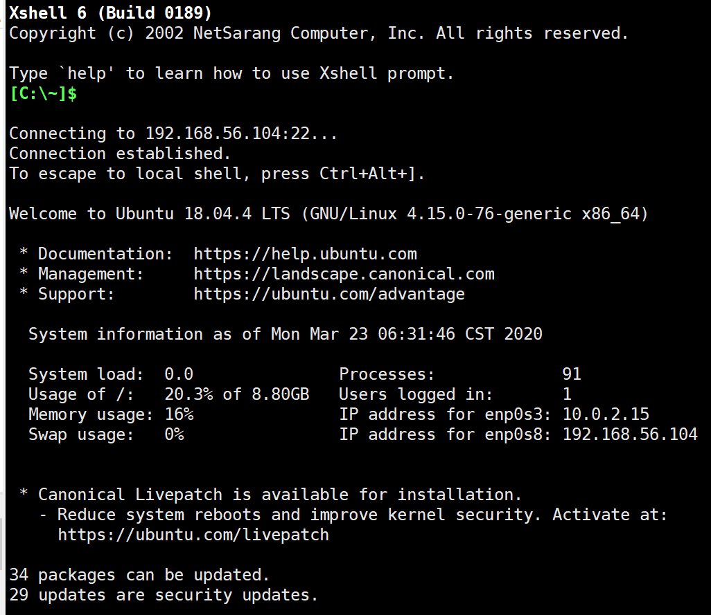
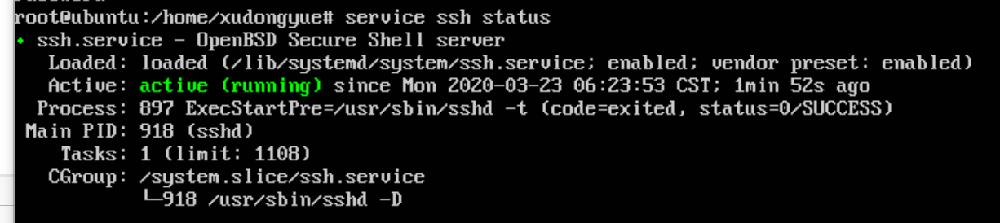
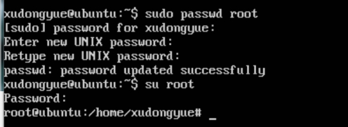
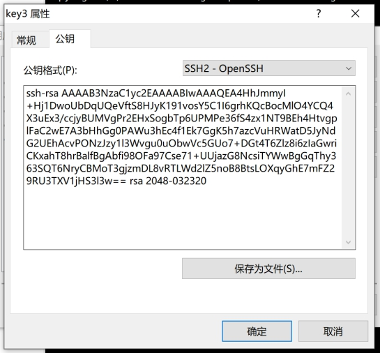
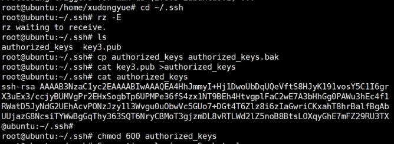
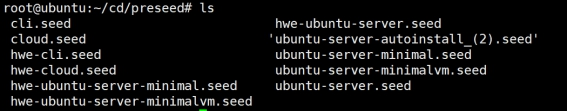

# 实验一 无人值守Linux安装
## 一、实验目的
- 配置无人值守安装iso并在Virtualbox中完成自动化安装
- 利用Xshell对虚拟机远程控制，并配置ssh免密码登陆
- 使用sftp在虚拟机和宿主机之间传输文件

## 二、实验环境
- Win10
- Virtualbox
- Ubuntu 18.04 Server 64bit
  - 双网卡
    - NAT
    - Host-only

## 三、实验过程
### 1. 有人值守安装Ubuntu18.04-server虚拟机，配置双网卡
- 1.1 启动安装ubuntu虚拟机
  
- 1.2 配置双网卡
  - ```sudo vim /etc/netplan/01-netcfg.yaml```，添加以下内容
      ```
      enp0s8
      dhcp4:yes
      ```
    
  - ```sudo netplan apply```  配置应用
  - ```ifconfig```  查看网卡信息

    

### 2. 利用Xshell远程登陆虚拟机，配置ssh免密码登陆
- 2.1 下载安装Xshell
  - 卸载已有Xshell（因为之前下载的是官付费版，评估期已过，需要购买）
    - *Error：卸载原来的版本的时候没有卸载干净，导致安装新的xshell提示只对当前安装文件有效*
    - *Solution：到 C盘，C:\Program Files (x86)\InstallShield Installation Information，删掉{F3FDFD5A-A201-407B-887F-399484764ECA}这个文件夹*
  - [下载 个人/学校免费版 Xshell](https://www.netsarang.com/zh/free-for-home-school/)
  

- 2.2 配置ssh免密码登陆
  - 准备工作
    - 远程登陆虚拟机
      - 打开Xshell设置主机为Host-only网卡ip地址
      <br/>*注：此时未注册密钥，新建会话，会弹出推荐密钥，点击【一次性接受即可】，最好不要点击【接受并保存】*

      

    - 确认ssh server是否正常工作
      - Ubuntu-18.04-server有人值守安装过程中已经安装了ssh server,确认是否正常工作
      
      

    - 获得root权限 
      - 切换到root权限，认证失败，要先设置root密码（切换到root权限下便于更改配置文件）

      

    - 创建~/.ssh/authorized_keys文件
      - ```mkdir ~/.ssh```  创建.ssh目录
        ```cd ~/.ssh```   转到该目录下
        ```touch authorized_keys```   创建authorized_keys文档

    - 修改配置文件/etc/ssh/sshd_config
      - 设置开启PublicKey认证登录
        - ```PubkeyAuthentication   yes```
          ```AuthorizedKeysFile   ~/.ssh/authorized_keys```

  - 生成密钥（公钥与私钥）
    - 打开Xshell，点击工具->新建用户密钥生成向导 生成公钥和私钥。
 
  - 放置公钥(Public Key)到~/.ssh/authorized_key文件中
    - 复制公钥将其粘贴到~/.ssh/authorized_key中
    
      

    - 也可以将公钥文件保存在本地，把.pub文件拖到Xshell上实现文件传输

      

  - 配置ssh客户端使用密钥登录
    - 在Virtualbox中将虚拟机重启，不用密码登陆
    - 在Xshell中，点击【新建】，填入虚拟机ip，在用户身份认证的窗口输入认证方法为“public key”，从用户秘钥出选择刚生成的私钥文件
    - 在Xshell中，点开刚刚新建的会话窗，输入 ```ssh root@192.168.56.104```，并在弹出的SSH用户身份验证框中的用户密钥选择私钥   

      

- 2.3 制作无人值守镜像文件
  
  - 执行如下命令
    ```
    # 在当前用户目录下创建一个用于挂载iso镜像文件的目录
    mkdir loopdir
    
    # 下载Ubuntu-18.04.4-server-amd64.iso
    wget http://cdimage.ubuntu.com/releases/18.04.4/release/ubuntu-18.04.4-server-amd64.iso
    
    # 挂载iso镜像文件到该目录
    sudo mount -o loop ubuntu-18.04.4-server-amd64.iso loopdir
    
    # 创建一个工作目录用于克隆光盘内容
    mkdir cd
    
    # 同步光盘内容到目标工作目录
    # 一定要注意loopdir后的这个/，cd后面不能有/
    rsync -av loopdir/ cd
    
    # 卸载iso镜像
    sudo umount loopdir
    
    # 进入目标工作目录，之后在虚拟机里的操作都在该目录下进行
    cd cd/
    
    # 编辑Ubuntu安装引导界面增加一个新菜单项入口
    vim isolinux/txt.cfg
      # 在txt.cfg中添加以下内容
      label autoinstall
         menu label ^Auto Install Ubuntu Server
         kernel /install/vmlinuz
         append  file=/cdrom/preseed/ubuntu-server-autoinstall.seed debian-installer/locale=en_US console-setup/layoutcode=us keyboard-configuration/layoutcode=us console-setup/ask_detect=false localechooser/translation/warn-light=true localechooser/translation/warn-severe=true initrd=/install/initrd.gz root=/dev/ram rw quiet
    ```

  - 将ubuntu-server-autoinstall.seed传入虚拟机
    - 通过sftp (git) 传输
      - 打开git bash
      - ```sftp xudongyue@192.168.56.104```，输入密码后成功连接到虚拟机
        - *Error：连接失败，显示```Permission denied(Publickey)```，原因是将/etc/ssh/sshd_config文件中PasswordAuthentication改为no*
        - *Solution：将PasswordAuthentication改为yes*
      - ```put C:/Users/xudon/Desktop/Linux截图/ubuntu-server-autoinstall.seed（2） ~/cd/preseed```，将文件传输到preseed目录下
        - *Error： 因为没有root权限，只能保存在/home/xudongyue/目录下*
        - *Solution：在Xshell中```mv /home/xudongyue/ubuntu-server-autoinstall.seed（1） ~/cd/preseed```，将seed文件转移到preseed目录下*

      

    - 通过lrzsz (Xshell) 传输   
      - 转到/home/xudongyue/preseed/目录下，将ubuntu-server-autoinstall.seed拖到Xshell中，实现文件传输
  
  - 在Xshell中vim打开isolinux/isolinux.cfg文件，修改timeout=0为timeout=10
  
  - 重新生成mad5sum.txt
    - ```cd ~/cd && find . -type f -print0 | xargs -0 md5sum > md5sum.txt```

  - 添加内容到shell文件中
      ```
    # 打开脚本
    vim shell
    
    # 添加以下内容
    # 封闭改动后的目录到.iso
    IMAGE=custom.iso
    BUILD=/home/cuc/cd/ #当前root用户，不能直接写~/cd/
    
    mkisofs -r -V "Custom Ubuntu Install CD" \
               -cache-inodes \
               -J -l -b isolinux/isolinux.bin \
               -c isolinux/boot.cat -no-emul-boot \
               -boot-load-size 4 -boot-info-table \
               -o $IMAGE $BUILD
    
    
    # 执行shell脚本。注意第一次尝试时会提醒没有mkisoft命令，要先下载genisoimage(下载之前记得apt update)
    sudo bash shell
    
    ```
  
  - 将制作完成的custom.iso传输到主机
    - 通过sfpt
      - 在Xshell中将custom.iso转存到/home/xudongyue/目录下
      - git bash执行命令```get /home/xudongyue/cd/custom.iso C:/Users/xudon/Desktop/Linux截图```

- 镜像制作完毕，利用custom.iso在Virtualbox中新建ubuntu虚拟机，并启动

## 四、思考与理解
- 在Xshell中，先将官方实例txt文件传输到虚拟机上preseed目录下，再利用vimdiff命令对比官方实例与ubuntu-server-autoinstall.seed文件 
- 
  
  
  
  
