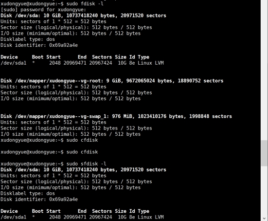

# 实验三 开机自启动项管理 Systemd
## 一、实验内容
- [Systemd 入门教程：命令篇](http://www.ruanyifeng.com/blog/2016/03/systemd-tutorial-commands.html)
- [Systemd 入门教程：实战篇](http://www.ruanyifeng.com/blog/2016/03/systemd-tutorial-part-two.html)

## 二、实验环境
- Ubuntu 18.04.4 Server 64bit

## 三、实验过程
### 1、命令篇
- [1.3 系统管理](https://asciinema.org/a/YzseMZQsxMiTlcxcqYeS9cqxs)
- [1.4 Unit](https://asciinema.org/a/BpptrMs5HPci2DZRSROAYuJE1)
- [1.5 Unit 的配置文件](https://asciinema.org/a/OdIRM3RudnIWkR7H1GBZrVyNn)
- [1.6 Target](https://asciinema.org/a/6BSFWPv9ZNruDtayeWjhelItr)
- [1.7 日志管理](https://asciinema.org/a/668Iqj0nj3AavaMKEAxMgjW1h)

### 2、实战篇
- [2.1 实战篇](https://asciinema.org/a/vEo8eTVUgKJQ6IFTEorC3pFpD)
  
## 四、实验自查清单
- 如何添加一个用户并使其具备sudo执行程序的权限？
  ```
  #添加用户friend2
  sudo adduser friend2

  #将friend2添加到sudo组内
  sudo usermod -a -G sudo friend2
  ```
  

- 如何将一个用户添加到一个用户组？
  ```
  #将friend2添加到adm组内
  sudo adduser friend2 adm
  ```
  

- 如何查看当前系统的分区表和文件系统详细信息？
  ```
  #查看当前系统分区表
  sudo fdisk -l
  sudo cfdisk

  #查看文件系统详细信息
  df -a
  ```
  
  
  
- 如何实现开机自动挂载Virtualbox的共享目录分区？
  ```
  # 新建挂载目录
  mkdir ~/sharefolder
  # 挂载共享文件夹ShareFolder到新建挂载目录
  sudo mount -t vboxsf virtualbox_share ~/sharefolder
  # 打开fstab文件修改配置文件
  sudo vi /etc/fstab
  # 添加配置信息
  virtualbox_share /home/cuc/sharefolder vboxsf defaults 0 0
  # 重启
  sudo reboot
  ```
  
- 基于LVM（逻辑分卷管理）的分区如何实现动态扩容和缩减容量？
  ```
  #查看逻辑卷信息
  sudo lvdisplay
  #创建LV
  sudo lvcreate -L 10MB xudongyue-vg -n swap_2
  #动态扩容3MB 
  sudo lvextend --size +3MB /dev/xudongyue-vg/swap_2
  #缩减容量3MB 
  sudo lvreduce --size -3MB /dev/xudongyue-vg/swap_2
  #更改大小3MB 
  sudo lvresize --size +3MB /dev/xudongyue-vg/swap_2
  ```

- 如何通过systemd设置实现在网络连通时运行一个指定脚本，在网络断开时运行另一个脚本？
  ```
  #修改NetworkManager.service配置文件

  # 设置网络联通时运行脚本test.sh
  ExecStartPost = test.sh
  # 假设网络断开是运行脚本test.sh
  ExecStopPost = test.sh
  ```

- 如何通过systemd设置实现一个脚本在任何情况下被杀死之后会立即重新启动？实现杀不死？
  ```
  设置配置文件service区块中的restart字段为always，即不管是什么退出原因，总是重启
  ```

## 五、实验遇到问题及解决
- 当实现开机自动挂载Virtualbox的共享目录分区时，```sudo mount -t vboxsf virtualbox_share ~/sharefolder```，报错```wrong fs type, bad option, bad superblock on virtualbox_share, missing codepage or helper program, or other error.```
  - [x] ```ll /sbin/mount*```  查看/sbin/mount文件，没有/sbin/mount.nfs文件
  - 
  - [x] 执行```sudo apt-get install nfs-common```，再查看/sbin/mount文件 ```ll /sbin/mount*```，产生新文件
  - 
  - [x] 执行```sudo apt-get install virtualbox-guest-utils```
  - [x] 重新执行```sudo mount -t vboxsf virtualbox_share ~/sharefolder```

