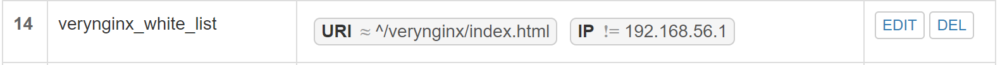
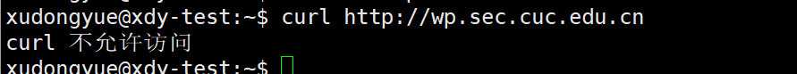

# 实验五：Web服务器

## 一、实验环境
#### 虚拟机
- Ubuntu 18.04.4 Server 64bit
    - NET
    - Host-only: 192.168.56.105
#### 网址&端口
- Nginx
  - Wordpress: ```wp.sec.cuc.edu.cn```    port:4433
  - DVWA: ```dvwa.sec.cuc.edu.cn```   port:8090
- VeryNginx
  - ```vn.sec.cuc.edu.cn```
  - port:80


## 二、实验过程

### 1、基本要求


##### （1）安装 Nginx
Nginx默认监听80端口，之后再进行修改
    ```
    sudo apt-get update
    sudo apt-get install nginx
    ```

##### （2）安装 verynginx
  - 安装依赖项
    ```
    sudo apt-get install libssl-dev
    sudo apt-get install libpcre3 libpcre3-dev
    #安装verynginx报错，提示要安装zlib-devel，在ubuntu下为zlib1g-dev
    sudo apt-get install zlib1g-dev
    ```
  - 安装verynginx
    ```
    git clone https://github.com/alexazhou/VeryNginx.git
    cd VeryNginx
    sudo python install.py install verynginx
    ```
  - 修改配置文件
    ```
    sudo vim /opt/verynginx/openresty/nginx/conf/nginx.conf
    #将user nginx修改为user www-data
    #修改server监听端口为192.168.56.105:8080; 之后再做修改
    ```
  - 运行Nginx
    ```
    #启动nginx
    sudo /opt/verynginx/openresty/nginx/sbin/nginx
    ```
    

##### （3）安装 WordPress 4.7
  - 安装并配置MySQL
    ```
    sudo apt install mysql-server

    #初次使用mysql
    sudo mysql

    #配置以root用户身份连接mysql，自定义密码替换password
    ALTER USER 'root'@'localhost' IDENTIFIED WITH mysql_native_password BY 'password';
    FLUSH PRIVILEGES;
    exit

    #再次登陆mysql
    mysql -u root -p

    #创建wordpress数据库
    CREATE DATABASE wordpress DEFAULT CHARACTER SET utf8 COLLATE utf8_unicode_ci;
    GRANT ALL ON wordpress.* TO 'wordpressuser'@'localhost' IDENTIFIED BY 'password';
    FLUSH PRIVILEGES;
    exit;
    ```
  - 安装PHP拓展
    ```
    sudo apt install php-curl php-gd php-intl php-mbstring php-soap php-xml php-xmlrpc php-zip
    sudo apt install php7.2-fpm
    sudo systemctl restart php7.2-fpm
    ```
  - 下载安装wordpress 4.7
    ```
    cd ~/tmp
    sudo wget https://wordpress.org/wordpress-4.7.zip
    unzip wordpress-4.7.zip

    #将解压后的wordpress移到指定路径下
    sudo mkdir /var/www/html/wp.sec.cuc.edu.cn
    sudo cp -r wordpress/. /var/www/html/wp.sec.cuc.edu.cn/
    sudo chown -R www-data:www-data /var/www/html/wp.sec.cuc.edu.cn
    ```
  - 设置WordPress配置文件
    ```
    cp /var/www/html/wp.sec.cuc.edu.cn/wp-config-sample.php /var/www/html/wp.sec.cuc.edu.cn/wp-config.php
    curl -s https://api.wordpress.org/secret-key/1.1/salt/
    sudo vim /var/www/html/wp.sec.cuc.edu.cn/wp-config.php
    ```
  - 修改nginx配置文件
    ```
    sudo vim /etc/nginx/sites-available/default

    server {
      ......
      root /var/www/html/wp.sec.cuc.edu.cn;
      index.php index.php index.nginx-debian.html;
      server_name wp.sec.cuc.edu.cn;

      location ~ \.php$ {
          include snippets/fastcgi-php.conf;
          fastcgi_pass unix:/var/run/php/php7.2-fpm.sock;
      }
      ......
    }
    ```
  - 运行Nginx
    ```
    sudo systemctl restart nginx
    ```
  - 自签证书
    ```
    sudo openssl req -x509 -nodes -days 365 -newkey rsa:2048 -keyout /etc/ssl/private/nginx-selfsigned.key -out /etc/ssl/certs/nginx-selfsigned.crt
    #Common Name (e.g. server FQDN or YOUR name) []:wp.sec.cuc.edu.cn

    #配置使用SSL
    sudo vim /etc/nginx/snippets/self-signed.conf
    # ssl_certificate /etc/ssl/certs/nginx-selfsigned.crt;
    # ssl_certificate_key /etc/ssl/private/nginx-selfsigned.key;

    #修改配置文件
    sudo vim /etc/nginx/sites-available/default

    server {
      ......
      listen 127.0.0.1:4433 ssl;
      include snippets/self-signed.conf;
      ......
    }
    
    sudo systemctl restart nginx
    ```

##### （4）安装 DVWA
  - 创建DVWA数据库
    ```
    sudo mysql -u root -p
    CREATE USER DVWA;
    CREATE DATABASE dvwa;
    GRANT ALL ON dvwa.* to DVWA@localhost identified by 'p@ssw0rd';
    FLUSH PRIVILEGES;
    exit;

    #重启mysql生效
    sudo systemctl restart mysql
    ```
  - 下载DVWA
    ```
    cd /var/www/html/
    sudo git clone https://github.com/ethicalhack3r/DVWA.git
    ```
  - 配置DVWA
    ```
    #/config/config.inc.php.dist 去掉.dist
    sudo cp /var/www/html/DVWA/config/config.inc.php.dist /var/www/html/DVWA/config/config.inc.php

    sudo vim /var/www/html/DVWA/config/config.inc.php
    # 修改配置文件为数据库保存信息
    $_DVWA[ 'db_server' ]   = '127.0.0.1';
    $_DVWA[ 'db_database' ] = 'dvwa';
    $_DVWA[ 'db_user' ]     = 'dvwauser';
    $_DVWA[ 'db_password' ] = 'p@ssw0rd';

    #修改php配置
    sudo vi /etc/php/7.2/fpm/php.ini    
    # allow_url_include = Off -> On

    #设置文件夹权限 
    sudo chown -R www-data.www-data /var/www/html/DVWA

    #重启php
    sudo systemctl restart php7.2-fpm
    ```
  - 修改Nginx配置文件
    ```
    sudo vi /etc/nginx/sites-available/default
    #修改第二个sever块
    server {
      ......
      listen 127.0.0.1:8090;
      server_name dvwa.sec.cuc.edu.cn;
      root /var/www/html/DVWA;
      index login.php index.php;

      location ~ \.php$ {
          include snippets/fastcgi-php.conf;
          fastcgi_pass unix:/var/run/php/php7.2-fpm.sock;
      }
      ......
    }
    sudo systemctl restart nginx
    ```

##### （5）其他必需配置
  - 宿主机 Windows 修改 C:\Windows\System32\drivers\etc\hosts
    ```
    192.168.56.105	vn.sec.cuc.edu.cn
    192.168.56.105	wp.sec.cuc.edu.cn
    192.168.56.105	dvwa.sec.cuc.edu.cn
    ```
  - VeryNginx 配置反向代理
  
  
  

##### 搭建结果
  
  
  


### 2、安全加固

##### （1）使用IP地址方式均无法访问上述任意站点，并向访客展示自定义的友好错误提示信息页面-1
Matcher

Response

Filter

结果显示

##### （2）Damn Vulnerable Web Application (DVWA)只允许白名单上的访客来源IP，其他来源的IP访问均向访客展示自定义的友好错误提示信息页面-2
Matcher

Response

Filter

结果显示

##### （3）在不升级Wordpress版本的情况下，通过定制VeryNginx的访问控制策略规则，热修复WordPress < 4.7.1 - Username Enumeration
Matcher

Response

Filter

结果显示

##### （4）通过配置VeryNginx的Filter规则实现对Damn Vulnerable Web Application (DVWA)的SQL注入实验在低安全等级条件下进行防护
Matcher

Filter

结果显示
更改前

更改后


### 3、VeryNginx配置要求
##### （1）VeryNginx的Web管理页面仅允许白名单上的访客来源IP，其他来源的IP访问均向访客展示自定义的友好错误提示信息页面-3
Matcher

Response

Filter

结果显示

##### （2）通过定制VeryNginx的访问控制策略规则实现：
Frequency Limit

- 限制DVWA站点的单IP访问速率为每秒请求数 < 50

- 限制Wordpress站点的单IP访问速率为每秒请求数 < 20

- 超过访问频率限制的请求直接返回自定义错误提示信息页面-4

- 禁止curl访问
- Matcher

Response

Filter

结果显示



## 三、问题与解决方法总结
1、nginx、verynginx、apache2 端口冲突
  - 由于在安装nginx之前已经安装了apache2，其默认占用80端口，致使启动nginx的时候显示端口被占用，我改了改apache2的配置文件，好像也....不太行（应该是没改正确），就先停用了apache2。
  - 启动nginx后，再安装verynginx，启动verynginx不成功，显示端口已占用，把nginx监听端口改为8090、4433，verynginx监听端口改为80，再重新启动就ok啦
  
2、修改verynginx/index.html相关配置，不能保存
  - 初次修改配置的时候发现不能保存，是由于/opt/verynginx/verynginx/configs/目录下没有config.json文件
    >查看alexazhou/VeryNginx说明文档大概意思是，为了避免更新verynginx导致之前配置好的config.json丢失，所以git库中忽略新建config.json文件
  - 在目录下新建config.json就可以保存了
  
3、匹配HOST=http://wp.sec.cuc.edu.cn，浏览器访问报错
  - Proxy Pass中wordpress的scheme为http，浏览器访问报```400 Bad Request: The plain HTTP request was sent to HTTPS port```
  - 更改scheme为https

4、错误信息显示（中文）乱码
  - 自定义response错误页面为中文的时候，网页显示乱码
  - 在verynginx配置文件sever中加上```charset utf-8```，就可以正常显示了

### 参考：
- https://www.digitalocean.com/community/tutorials/how-to-install-linux-nginx-mysql-php-lemp-stack-ubuntu-18-04
- https://www.digitalocean.com/community/tutorials/how-to-create-a-self-signed-ssl-certificate-for-nginx-in-ubuntu-18-04
- https://www.digitalocean.com/community/tutorials/how-to-install-wordpress-with-lemp-on-ubuntu-18-04
- https://github.com/CUCCS/linux-2019-jckling/blob/0x05/0x05/%E5%AE%9E%E9%AA%8C%E6%8A%A5%E5%91%8A.md
- https://github.com/alexazhou/VeryNginx/wiki/Trouble-Shooting
- https://github.com/alexazhou/VeryNginx

