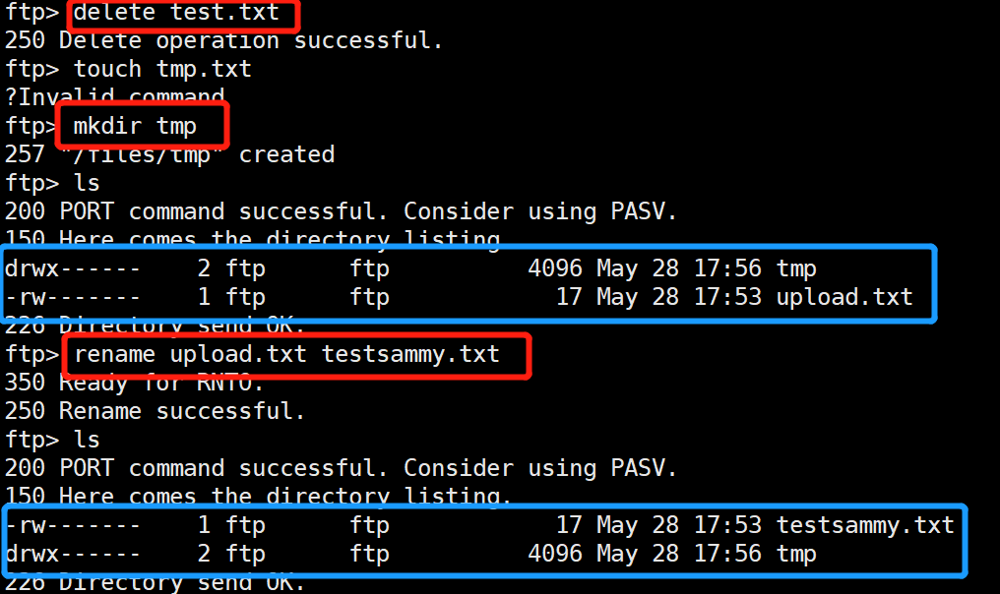
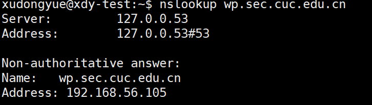

# 实验六：shell脚本编程练习进阶

>FTP、NFS、DHCP、DNS、Samba服务器的自动安装与自动配置

## 一、实验环境
- 工作主机（Ubuntu 18.04.4-Server-64bit）：192.168.56.106
- 客户主机（Ubuntu 18.04.4-Server-64bit）：192.168.56.105
- 目标主机（Ubuntu 18.04.4-Server-64bit）：192.168.56.107
>工作主机进行手动配置，工作主机作为服务端，客户主机作为客户端；
目标主机进行部分自动配置
### 自动安装与自动配置
##### 1、ssh免密登陆
- 目标主机
   -  ```sudo service ssh start```，开启ssh服务
   -  更改ssh配置文件```/etc/ssh/sshd_config```
    
- 工作主机
   -  ```ssh-keygen -t rsa```，生成一对公私钥
   -  ```sudo ssh-copy-id -i ~/.ssh/id_rsa.pub root@192.168.56.107```，将公钥传输道目标主机```authorized_keys```文件中
##### 2、将脚本从工作主机拷贝到目标主机
- ```
  scp ftp.sh root@192.168.56.107:/home/xdy3/auto
  scp environ.sh root@192.168.56.107:/home/xdy3/auto
  scp nfs_clt.sh root@192.168.56.107:/home/xdy3/auto
  scp nfs_srv.sh root@192.168.56.107:/home/xdy3/auto
  scp smb_srv.sh root@192.168.56.107:/home/xdy3/auto
  ```
##### 3、远程运行脚本
- ```
  ssh root@192.168.56.107 'sudo bash auto/ftp.sh'
  ```

### FTP
- 配置一个提供匿名访问的FTP服务器，匿名访问者可以访问1个目录且仅拥有该目录及其所有子目录的只读访问权限
  - 
- 配置一个支持用户名和密码方式访问的账号，该账号继承匿名访问者所有权限，且拥有对另1个独立目录及其子目录完整读写（包括创建目录、修改文件、删除文件等）权限
  - 继承匿名访问者权限(访问目录、读访问)，其他权限（创建目录、修改文件、删除文件）
    
    
- 匿名访问权限仅限白名单IP来源用户访问，禁止白名单IP以外的访问
  - 修改```vsftpd.conf```配置文件
    ```
    tcp_wrappers=YES
    ```
  - 重新启动vsftpd
  - 在```/etc/hosts.deny```拒绝**所有**IP
    ```
    vsftpd:ALL
    ```
  - ```/etc/hosts.allow```添加**允许访问**的IP
    ```
    vsftpd:192.168.56.105
    ```
  - 添加允许访问的IP之前，客户端访问
    
  - 添加之后，客户端访问
    
- 参考
  - [How To Set Up vsftpd for Anonymous Downloads on Ubuntu 16.04](https://www.digitalocean.com/community/tutorials/how-to-set-up-vsftpd-for-anonymous-downloads-on-ubuntu-16-04)
  - [How To Set Up vsftpd for a User's Directory on Ubuntu 16.04](https://www.digitalocean.com/community/tutorials/how-to-set-up-vsftpd-for-a-user-s-directory-on-ubuntu-16-04)
  - [vsftpd : limit connection to a set of IP addresses](https://serverfault.com/questions/577393/vsftpd-limit-connection-to-a-set-of-ip-addresses)
  - [vsftpd for both local users and anonymous logins](https://serverfault.com/questions/844935/vsftpd-for-both-local-users-and-anonymous-logins)


### NFS
- 在1台Linux上配置NFS服务，另1台电脑上配置NFS客户端挂载2个权限不同的共享目录，分别对应只读访问和读写访问权限
    
  - **server端**```/etc/exports```中，设置**home**目录为可读可写，**general**目录为只读
    ```
    /var/nfs/general 192.168.56.105(sync,no_subtree_check)
    /home    192.168.56.105(rw,sync,no_root_squash,no_subtree_check)
    ```
  - **可以**在client端**home**目录中创建文件，**不可以**在client端**general**目录中创建文件
    
- 客户端共享目录中文件、子目录的属主、权限信息和在NFS服务器端上查看到的信息一样吗？
  - 客户端和服务端 **uid** 、 **gid** 、**权限**是一样的
  - 参考解释
  >no_root_squash: By default, NFS translates requests from a root user remotely into a non-privileged user on the server. This was intended as security feature to prevent a root account on the client from using the file system of the host as root. no_root_squash disables this behavior for certain shares.
  - **server**端中**home**目录
    
  - **client**端中**home**目录
    
   >我们```home.test```通过```sudo```命令以```root```用户身份创建，与创建```general.test```文件的方式完全相同。但是，在这种情况下，它是由```root```拥有的，因为当我们```no_root_squash```在此挂载上指定选项时，我们将覆盖默认行为。这使我们在客户端计算机上的```root```用户可以充当```root```用户，并使用户帐户的管理更加方便。同时，这意味着我们不必授予这些用户对主机的```root```访问权限。
  - 在**general**目录添加了写权限，查看**没有**```no_root_squash```参数的目录相关信息
  - **server**端中**general**目录
    
  - **client**端中**general**目录
    
  >因为我们在不更改```NFS```缺省行为的情况下挂载了该卷，并通过```sudo```命令将其作为客户端计算机的根用户创建了该文件，所以该文件的所有权默认为```nobody：nogroup```。客户端超级用户将无法在此```NFS```挂载的共享上执行典型的管理操作，例如更改文件的所有者或为一组用户创建新目录。
- 参考
  - [How To Set Up an NFS Mount on Ubuntu 16.04](https://www.digitalocean.com/community/tutorials/how-to-set-up-an-nfs-mount-on-ubuntu-16-04)


### Samba
- ```
  sudo apt update
  sudo apt install smbclient
  ```
- [设置共享文件](https://www.howtogeek.com/126214/how-to-create-network-file-shares-with-no-passwords-in-windows-8/)
  
    - 访问失败——解决方法：所有网络中**关闭密码保护共享** 
    
- Linux访问Windows的匿名共享目录
  
- Linux访问Windows的用户名密码方式共享目录
  
- 下载整个目录
  


### DHCP
##### server端
- ```sudo apt install isc-dhcp-server```
- 修改```/etc/default/isc-dhcp-server```文件
  
- 修改```/etc/dhcp/dhcpd.conf```文件
  
- 重启服务```sudo service isc-dhcp-server restart```
- 
##### client端
- 修改```/etc/network/interfaces```文件
  
- ```sudo netplan apply```
- 重启网络
- 
>在配置过程中遇到些问题，例如重启服务```DHCP```后，再查看服务进程```systemctl status isc-dhcp-server```发现报错，可以**查看日志文件**```vim /var/log/syslog```来解决
- 参考
  - [Setup DHCP server on ubuntu 16.04 (Xenial Xerus) Server](http://www.ubuntugeek.com/setup-dhcp-server-on-ubuntu-16-04-xenial-xerus-server.html)


### DNS
##### server端
- 安装Bind
```sudo apt-get install bind9 bind9utils bind9-doc```
- 在```/etc/bind/named.conf.options```文件中，设置信任客户端
```
acl "trusted" {
    192.168.56.106;
};
```
在options选项中添加
```
recursion yes;                 # enables resursive queries
allow-recursion { trusted; };  # allows recursive queries from "trusted" clients
listen-on { 192.168.56.105; };   # ns1 private IP address - listen on private network only
allow-transfer { none; };      # disable zone transfers by default
forwarders {
    8.8.8.8;
    8.8.4.4;
};
```
- 修改```/etc/bind/named.conf.local```文件
  
- ```
  sudo mkdir /etc/bind/zones
  cd /etc/bind/zones
  sudo cp ../db.local ./db.cuc.edu.cn
- 修改```/etc/bind/zones/db.cuc.edu.cn```文件
  
- 重启bind9```sudo service bind9 restart```
##### client端
- ```sudo apt install resolvconf```
- ```sudo vi /etc/resolvconf/resolv.conf.d/head```
  
- ```sudo resolvconf -u```
##### 测试
- **client**
  
  
  
- 参考
  - [How To Configure BIND as a Private Network DNS Server on Ubuntu 14.04](https://www.digitalocean.com/community/tutorials/how-to-configure-bind-as-a-private-network-dns-server-on-ubuntu-14-04#prerequisites)

#### 参考
- https://github.com/CUCCS/2015-linux-public-JuliBeacon/blob/exp6/%E5%AE%9E%E9%AA%8C%206/%E5%AE%9E%E9%AA%8C6.md